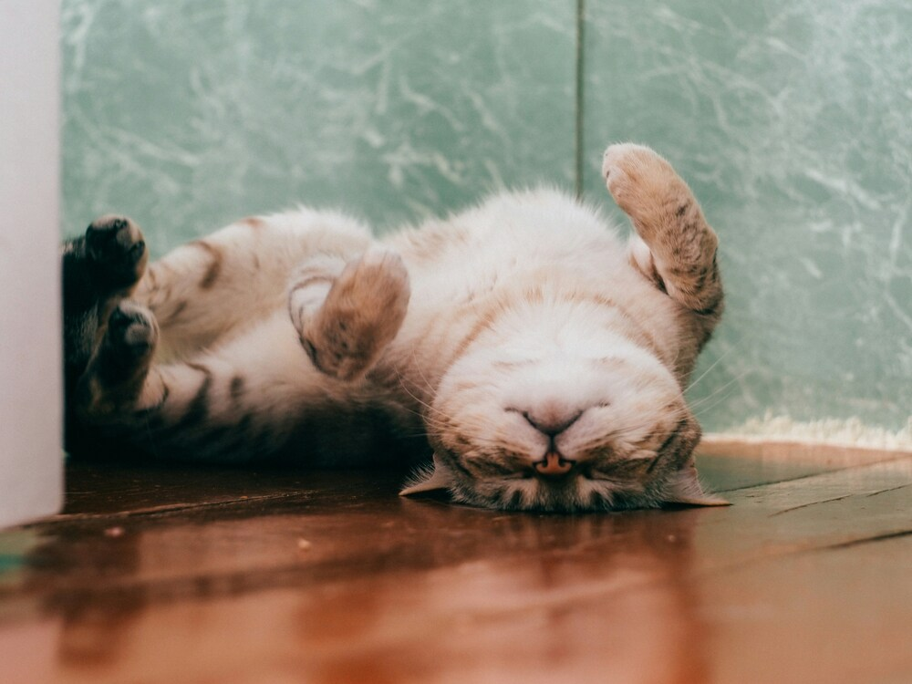

+++
title = "Katzen Fanseite"
date = "2024-06-11"
draft = false
pinned = false
tags = ["Deutsch", "Katzen"]
image = "katze-klein.jpg"
+++
Katzen, diese wundervollen Geschöpfe, die die Welt mit ihrer Anmut und Eleganz bereichern! Ihre samtweichen Pfoten streicheln die Erde mit einer Zärtlichkeit, die nur ihnen eigen ist. Jede Bewegung, sei sie noch so klein, zeugt von einer Grazie, die die Herzen aller Menschen erobert. Ihre Augen, in denen das Universum zu tanzen scheint, funkeln wie Juwelen in der Dunkelheit und versetzen jeden Betrachter in Staunen. Sie sind die Verkörperung von Mystik und Schönheit, von Ruhe und zugleich wilder Entschlossenheit.

## Das Magische Schnurren

Wenn eine Katze schnurrt, ist es, als ob die Seele selbst ein Wiegenlied anstimmt. Ihr Schnurren, ein zartes Brummen, das in den Tiefen unseres Herzens widerhallt, ist eine Melodie der Zufriedenheit und des Friedens. Sie verstehen es, in uns eine tiefe Ruhe und Geborgenheit zu wecken, die nur wenige andere Lebewesen zu schenken vermögen. Und wenn sie spielen, dann wird der Raum um sie herum von purer Lebensfreude erfüllt. Ihre verspielten Sprünge und neckischen Bewegungen sind ein Schauspiel der Leichtigkeit und der Freude.

